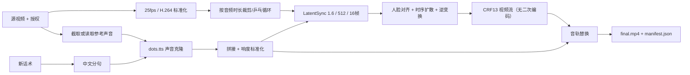

# LatentSync 1.6 云端高画质口型项目架构书

版本：1.0  
日期：2026-08-18  
状态：开发基线  
实现分支：`codex/latentsync-1.6-cloud`

> 本文档是 LatentSync 云端方案的唯一架构事实来源。其他大语言模型继续开发时，
> 如与旧 MuseTalk MVP 文档冲突，以本文档、`LATENTSYNC_CLOUD_INSTALLATION.md`
> 和 `LATENTSYNC_CLOUD_ACCEPTANCE.md` 为准，不得根据记忆猜测版本、权重或参数。

## 1. 项目背景

客户提供：

1. 一段已录制的单人竖屏视频。
2. 人物正脸或轻微转头，身体和手势基本不变。
3. 人物可能在胸前手持广告牌、证书或身份证。
4. 一段与人物声音匹配的参考音频或可从源视频截取的声音。
5. 一段新中文话术。

系统输出：

- 人物使用克隆后的新声音说出新话术。
- 嘴唇、牙齿、舌头、脸颊和下颌运动与新音频同步。
- 背景、身体、手、衣服和手持物不重新生成。
- 以视频质量和嘴部自然度为第一优先级，不要求实时。

## 2. 素材边界

### 2.1 可接受素材

- 单人、单镜头、正脸为主。
- 嘴部无长时间手部或证件遮挡。
- 光线稳定，脸部不过曝。
- 首选 1080×1920 以上原始相机文件；Demo 可使用 720×1280。
- 原始人脸宽度最低 300 像素，正式交付建议 500 像素以上。

### 2.2 拒绝或单独研发的素材

- 多人同时出镜或频繁镜头切换。
- 大幅度侧脸、低头、快速运动。
- 嘴部被口罩、手、话筒或证件持续遮挡。
- 强美颜导致嘴唇边界已丢失的素材。
- 低于 480p、多次社交软件转码的素材。

## 3. 实现范围

### 3.1 本版必须实现

- dots.tts 声音克隆，保留现有可用链路。
- 视频标准化为 25fps。
- 按目标音频时长裁剪或乒乓循环原视频。
- LatentSync 1.6、512×512 人脸区域、16 帧时序窗口。
- 支持 20～50 推理步和 1.0～3.0 guidance scale。
- 默认 30 步、guidance 1.3、DeepCache 关闭，优先建立无近似计算的画质基线。
- 修复官方二次 H.264 编码，保留官方 CRF13 视频流。
- 最终封装时复制 LatentSync 视频流，只替换目标 AAC 音轨。
- 保留 MuseTalk 1.5 作为本地快速预览/回归对照，不作为高画质默认引擎。
- office/home/cloud 三套机器配置互不污染。
- 所有权重、环境和缓存位于项目根目录。
- 任务日志、哈希、参数、引擎和提交号可审计。

### 3.2 本版不实现

- 实时直播。
- Wan/Hunyuan/InfiniteTalk 等整段视频重新生成。
- 自动修改手势、背景或证件内容。
- 为单个客户重新训练 LatentSync。
- 云端任务队列、Web UI、多租户权限。
- 用 GFPGAN/CodeFormer 对全脸二次美颜。

## 4. 技术决策

### 4.1 为什么替换 MuseTalk

MuseTalk 1.5 将脸部区域固定缩放到 256×256，官方已列出嘴唇形状/颜色、
胡须细节丢失和单帧抖动限制。后处理只能恢复嘴巴外围的高频皮肤纹理，
不能恢复模型从未生成的牙齿、舌头和嘴唇几何。

LatentSync 1.6 针对 1.5 的嘴唇/牙齿模糊问题使用 512×512 训练数据，
并使用时序模块和音频条件扩散直接生成连续口型，更符合本项目的质量目标。

### 4.2 为什么不叠加原 MuseTalk 纹理合成

LatentSync 自带人脸仿射对齐、标准脸蒙版和逆变换还原。首轮如再叠加
`dynamic_texture` 会混入旧嘴型风险，也会让模型 A/B 失去可归因性。
因此 LatentSync 任务固定使用 `composite.mode=native`。

## 5. 总体架构



## 6. 运行环境隔离

| 环境 | Python | 主要职责 | 主要框架 |
|---|---:|---|---|
| `.conda-envs/digital-human` | 3.11.9 | 编排、FFmpeg、配置、日志 | NumPy 2.2.6 / OpenCV 4.12 |
| `.conda-envs/dots-tts` | 3.11.9 | 声音克隆 | dots.tts 0.3.1 / Torch 2.8.0 cu128 |
| `.conda-envs/latentsync` | 3.10.13 | 口型推理 | Torch 2.5.1 cu121 / Diffusers 0.32.2 |
| `.conda-envs/musetalk` | 3.10.14 | 旧引擎回归 | 仅 office/home 需要 |

禁止把 dots.tts 和 LatentSync 安装到同一 Python 环境。

## 7. 云服务器规格

Demo 和首轮产品验证的固定规格：

| 项目 | 要求 |
|---|---|
| GPU | NVIDIA RTX 4090 24GB（单卡） |
| RAM | 最低 64GB |
| CPU | 8～16 vCPU |
| 磁盘 | 最低 100GB 可用，建议 150GB |
| OS | Ubuntu 22.04 LTS |
| NVIDIA Driver | 支持 CUDA 12.1 运行时 |
| FFmpeg | 必须含 libx264/AAC |

更换 A100/H800 不会提高同一 LatentSync 权重的单帧画质，不应在 Demo 阶段浪费预算。

## 8. 代码层次与职责

```text
src/digital_human/
├── cli.py
│   └── doctor / run / refine / preview-roi
├── config.py
│   └── office/home/cloud 机器配置与任务参数校验
├── pipeline.py
│   └── TTS、时长适配、口型引擎分发、封装和 manifest
├── ffmpeg.py
│   └── 25fps、WAV、时长、CRF/视频流复制
├── composite.py
│   └── 仅 MuseTalk 回退链路使用；LatentSync native 链路禁用
└── adapters/
    ├── dots_tts.py
    │   └── 调用独立 dots.tts 环境
    ├── musetalk.py
    │   └── 旧 256 引擎回归
    └── latentsync.py
        └── 固定 1.6 官方入口、512 配置、参数与产物校验

scripts/
├── setup_cloud_4090.sh
│   └── 创建三个云端环境、固定官方仓库、应用质量补丁
├── download_latentsync_models.sh
│   └── 下载 LatentSync 1.6 全部权重和 VAE 缓存
├── download_cloud_models.sh
│   └── 调用上述脚本并补齐 dots.tts SOAR/MF 权重
└── run_job.sh
    └── 使用 cloud profile 执行完整任务

patches/
└── latentsync-1.6-quality-mux.patch
    └── 将官方最后封装从 CRF18 重编码改为视频流 copy
```

## 9. 核心实现逻辑

```python
assert job.consent_confirmed
validate_inputs(job)

source = normalize_video(job.source_video, fps=25)
reference = job.reference_audio or extract_reference_audio(source)
speech_segments = split_script(job.script, max_chars=60)

target_audio = concat_and_normalize([
    dots_tts.clone(
        text=segment,
        prompt_audio=reference,
        prompt_text=job.reference_text,
    )
    for segment in speech_segments
])

base = match_video_duration(
    source,
    target_duration=duration(target_audio),
    policy=job.video.duration_policy,
)

if job.lipsync.engine == "latentsync_1_6":
    # 官方 stage2_512.yaml：512px、16 frames、FP16；画质基线关闭 DeepCache。
    synced = latentsync.generate(
        video=base,
        audio=target_audio,
        steps=job.lipsync.inference_steps,
        guidance=job.lipsync.guidance_scale,
        seed=job.lipsync.seed,
    )
    # synced 内的视频流已是 CRF13，只 copy，禁止再编码。
    final = mux_audio(synced, target_audio, copy_video=True)
else:
    generated = musetalk.generate(base, target_audio)
    refined = muse_texture_composite(base, generated)
    final = mux_audio(refined, target_audio, crf=12)

write_manifest(
    final,
    engine=job.lipsync.engine,
    repo_commit=LATENTSYNC_COMMIT,
    parameters=job.lipsync,
)
```

## 10. 固定依赖

### 10.1 LatentSync 官方仓库

- URL：`https://github.com/bytedance/LatentSync.git`
- 固定提交：`a229c3948406bc2cf6eaf4873e662e70c6a04746`
- 禁止直接跟随 `main`。升级提交必须单独建分支并重跑全部验收。

### 10.2 LatentSync Python 依赖

必须使用官方提交中的 `requirements.txt`，当前固定值：

```text
Python 3.10.13
torch==2.5.1
torchvision==0.20.1
CUDA wheel index: cu121
diffusers==0.32.2
transformers==4.48.0
decord==0.6.0
accelerate==0.26.1
einops==0.7.0
omegaconf==2.3.0
opencv-python==4.9.0.80
mediapipe==0.10.11
python_speech_features==0.6
librosa==0.10.1
scenedetect==0.6.1
ffmpeg-python==0.2.0
imageio==2.31.1
imageio-ffmpeg==0.5.1
lpips==0.1.4
face-alignment==1.4.1
gradio==5.24.0
huggingface-hub==0.30.2
numpy==1.26.4
kornia==0.8.0
insightface==0.7.3
onnxruntime-gpu==1.21.0
DeepCache==0.1.1
```

不得为了“解决安装冲突”擅自升级 Torch、Diffusers、Transformers、
InsightFace 或 ONNX Runtime。

### 10.3 权重

| 模型 | 官方 ID | 本地位置 | 说明 |
|---|---|---|---|
| LatentSync 1.6 全量 | `ByteDance/LatentSync-1.6` | `external/LatentSync/checkpoints/` | 约 9.64GB |
| LatentSync UNet | 同上 | `checkpoints/latentsync_unet.pt` | 5.07GB，SHA256 `0a478e89...e98316d3` |
| Stable SyncNet | 同上 | `checkpoints/stable_syncnet.pt` | 1.61GB，评估/训练使用 |
| Whisper Tiny | 同上 | `checkpoints/whisper/tiny.pt` | 推理必需 |
| InsightFace 辅助权重 | 同上 `auxiliary/` | `checkpoints/auxiliary/` | 人脸检测与106点 |
| InsightFace buffalo_l | InsightFace v0.7 官方 release | `checkpoints/auxiliary/models/buffalo_l/` | `det_10g.onnx` + `2d106det.onnx` 推理必需 |
| SD VAE | `stabilityai/sd-vae-ft-mse` | `.cache/huggingface/` | 官方代码按 ID 加载 |
| dots.tts SOAR | `dots-studio/dots.tts-soar` | `models/dots.tts-soar/` | 高质量声音 |
| dots.tts MF | `dots-studio/dots.tts-mf` | `models/dots.tts-mf/` | 快速回退 |

`download_latentsync_models.sh` 必须下载完整 LatentSync 1.6 仓库，不要只下载 UNet，
否则 InsightFace/Whisper 可在首次任务中隐式连网。

## 11. 任务配置

```yaml
video:
  fps: 25
  duration_policy: "pingpong"
  final_crf: 12

lipsync:
  engine: "latentsync_1_6"
  inference_steps: 30
  guidance_scale: 1.3
  seed: 1247
  enable_deepcache: false

composite:
  mode: "native"
  texture_strength: 0.0
```

生产参数边界：

- `inference_steps`：20～50；默认 30。
- `guidance_scale`：1.0～3.0；默认 1.3；闪烁时先降到 1.2。
- `seed`：默认 1247；A/B 测试时必须固定。
- `enable_deepcache`：画质基线默认 `false`；仅在同 seed A/B 确认无观感差异后开启。
- `final_crf`：LatentSync 视频流复制时不生效；MuseTalk 回退时建议 12～14。

## 12. 任务目录

```text
jobs-cloud/<job_id>/
├── input/
│   ├── source.mp4
│   └── reference.wav
├── work/
│   ├── source_25fps.mp4
│   ├── tts_segments/*.wav
│   ├── target_normalized.wav
│   ├── base_duration_matched.mp4
│   ├── latentsync_temp/
│   └── latentsync_result.mp4
├── output/
│   └── final.mp4
├── logs/
│   ├── tts_*.log
│   └── latentsync.log
└── manifest.json
```

## 13. 失败策略

- 权重不完整：立即失败，不在任务中自动下载。
- 官方仓库提交不匹配：`doctor` 失败。
- 高画质 mux 补丁未应用：Adapter 拒绝运行。
- 人脸检测失败：当前任务失败，不切换随机人脸。
- 4090 OOM：确认无其他 GPU 进程；仍 OOM 则升级 32/48GB，不降到 256 分辨率。
- 嘴部闪烁：guidance 1.3 降到 1.2；再以 seed 1247/42 做 A/B。
- 嘴部仍模糊：检查是否使用原始相机素材；不使用 GFPGAN 掩盖。
- 同 `job_id` 配置变更：使用新 ID，或人工确认后 `--force`。

## 14. 质量 A/B 规则

模型、步数、guidance、seed 任一变更时，使用同一 3～5 秒片段生成：

1. MuseTalk 1.5 当前基线。
2. LatentSync 1.6 / 20 / 1.3 / seed 1247。
3. LatentSync 1.6 / 30 / 1.3 / seed 1247。
4. LatentSync 1.6 / 30 / 1.2 / seed 1247。

盲测文件名不得包含引擎名和参数。不允许只看单帧，必须以 1× 和 0.25× 观看动态结果。

## 15. 其他大模型开发约束

1. 不得把 LatentSync 依赖安装到 dots.tts 环境。
2. 不得使用 LatentSync 1.5 权重冒充 1.6。
3. 不得把 `stage2.yaml` 256 配置冒充 `stage2_512.yaml`。
4. 不得在最后封装中重新编码 LatentSync 视频流。
5. 不得在 LatentSync 输出上默认启用 MuseTalk `dynamic_texture`。
6. 不得在未做 3～5 秒 A/B 前运行长视频或批量任务。
7. 不得只用截图宣称验收通过。
8. 修改官方提交、权重、Torch、Diffusers 或推理分辨率必须单独提交并附 A/B。
9. 新增生成式全脸修复必须默认关闭，不得以磨皮换取“蒙版不明显”。
10. 发布前必须执行 `pytest`、`ruff check`、`doctor --profile cloud` 和视频验收清单。
