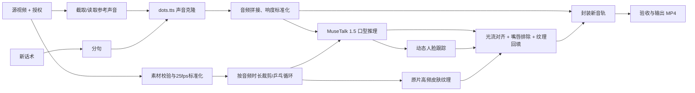

# 项目架构书：本地口型数字人视频生成系统

> 注意：本文档保留 MuseTalk 本地回退链路的设计历史。
> `codex/latentsync-1.6-cloud` 分支的高画质主架构以
> [LATENTSYNC_CLOUD_ARCHITECTURE.md](LATENTSYNC_CLOUD_ARCHITECTURE.md) 为准。

版本：0.2（动作/纹理解耦合成）
日期：2026-08-18

## 1. 项目背景

客户提供：

1. 一段已经录制好的单人人物视频；背景通常为白色、纯色或少量杂物。
2. 人物动作基本不变，可能在胸前手持广告牌、证书或身份证。
3. 视频中有可用于声音克隆的普通话或轻微地方口音语音。
4. 一段新的中文话术。

系统生成一段新视频：

- 声音应接近原人物音色和说话习惯。
- 口型应与新声音同步。
- 不重新生成背景、身体、手、衣服、广告牌、证书或身份证。
- 背景、身体、手持物使用原始像素；下半脸使用 MuseTalk 的新音频动作，再回填原片毛孔、痘坑、胡茬等高频纹理。
- 所有敏感素材在本地处理，不上传第三方服务。

## 2. MVP 范围

### 2.1 必须实现

- 接收 MP4/MOV 源视频、参考音频或从源视频截取参考音频、参考音频精确文字、新话术。
- 将源视频标准化为固定 25fps、H.264、无音轨的中间视频。
- 使用 dots.tts 生成克隆语音。
- 长话术按标点分句，逐段生成后拼接和响度标准化。
- 根据目标音频长度裁剪或乒乓循环源视频。
- 使用 MuseTalk 1.5 生成口型视频。
- 使用动态纹理合成器：MuseTalk 负责嘴唇、脸颊和下颌低频动作，原片只提供高频皮肤细节。
- 保留静态椭圆 ROI 作为回归测试的兼容模式，不作为默认产出链路。
- 将目标声音封装进最终 MP4。
- 记录输入哈希、配置、命令、阶段状态和输出路径。
- 未确认人物授权时拒绝运行。

### 2.2 MVP 不实现

- 实时直播推流。
- 从单张照片生成完整数字人。
- 自动修改人物手势或身体动作。
- 云端模型/API。
- 自动读取或识别身份证号码。
- 为每个人训练专属口型模型。
- 复杂转头、遮脸、多人物、多镜头剪辑。

### 2.3 后续版本

- 替换 Haar 人脸跟踪为商用许可明确的面部关键点/语义分割模型，生成精确的嘴唇、口腔和皮肤蒙版。
- dots.tts.edit 局部语音纠错。
- Qwen3-TTS 1.7B 备用声音引擎。
- Remotion 字幕、Logo、信息卡、片头片尾和多段时间线。
- SyncNet 自动音画评分、ASR 回识别和 OCR 保护区校验。
- 公司 RTX 3060 与家庭 RTX 4070 使用独立机器配置；不做跨机器或局域网调度。

## 3. 核心设计原则

1. **原片优先**：能使用原始帧的区域绝不交给生成模型。
2. **本地优先**：人脸、声纹、证件和输出不离开客户授权的本地设备。
3. **环境隔离**：编排、TTS、口型三个 Python 环境不得混装。
4. **短段生成**：TTS 每段建议 5～20 秒，降低显存和长文本漂移。
5. **可重跑**：每个阶段有确定输入和输出，失败只重跑当前阶段。
6. **可审计**：保存配置快照、SHA-256、模型名、命令和日志。
7. **动作/纹理解耦**：不得把原片与新音频不一致的嘴唇、脸颊、下颌低频形变贴回；原片只参与高频纹理恢复。
8. **授权前置**：配置文件必须显式确认肖像和声音授权。

## 4. 总体架构



## 5. 为什么必须使用三个环境

截至本架构书日期，官方依赖为：

- dots.tts 0.3.1：PyTorch 2.8、Transformers 4.57、NumPy 2.2.6。
- MuseTalk：PyTorch 2.0.1、Transformers 4.39.2、NumPy 1.23.5，并依赖 MMLab 组件。

这两组版本不能可靠共存。禁止为了“只用一个环境”擅自升级 MuseTalk 或降级 dots.tts。

三个环境：

| 环境 | 职责 | GPU |
|---|---|---|
| `G:\duikouxing\.conda-envs\digital-human` | 编排、FFmpeg、纹理合成、日志 | Python 3.11.9 |
| `G:\duikouxing\.conda-envs\dots-tts` | 声音克隆 | Python 3.11.9 |
| `G:\duikouxing\.conda-envs\musetalk` | 口型生成 | Python 3.10.14 |

环境之间仅通过 WAV、MP4、YAML、JSON 文件和子进程退出码通信。

### 5.1 机器配置隔离

两台电脑不在同一局域网，每台电脑都拥有完整环境、模型和流水线，不进行远程调用：

| 配置 | 机器 | 任务目录 | MuseTalk batch |
|---|---|---|---:|
| `config/local.office.yaml` | 公司 RTX 3060 12GB | `G:\duikouxing\jobs-office` | 2 |
| `config/local.home.yaml` | 家庭 RTX 4070 12GB | `G:\duikouxing\jobs-home` | 4 |

通过 CLI 的 `--profile office|home` 或 `scripts/run_job.ps1 -Profile` 切换。任务 YAML 不保存硬件参数，因此同一个任务配置可在两台电脑之间复制；机器相关的批次、GPU 型号检查和输出根目录由 profile 管理。

## 6. 代码层次与职责

```text
src/digital_human/
├── cli.py                 # 命令行入口：doctor、preview-roi、run、refine
├── config.py              # YAML 配置加载、路径解析和业务校验
├── pipeline.py            # 阶段编排、任务目录和清单写入
├── ffmpeg.py              # ffprobe、抽取声音、标准化、时长适配、封装
├── audio.py               # 中文分句、音频段拼接
├── composite.py           # 动态纹理回填、光流对齐与旧 ROI 兼容模式
├── manifest.py            # SHA-256、状态、配置快照
└── adapters/
    ├── dots_tts.py        # 调用独立 dots.tts 环境
    └── musetalk.py        # 生成 MuseTalk YAML 并调用官方推理入口
```

### 6.1 `config.py`

- 根据 `--profile office|home` 加载 `config/local.office.yaml` 或 `config/local.home.yaml`，再加载任务 YAML。
- 相对路径以任务 YAML 所在目录解析。
- 检查源视频、参考音频、参考文本、新话术。
- 检查 `consent_confirmed: true`。
- 检查 ROI 坐标在 0～1 范围内。

### 6.2 `ffmpeg.py`

- 使用参数数组调用 FFmpeg，避免 shell 注入和 Windows 路径转义问题。
- 统一帧率为 25fps。
- 从源视频按起始时间和时长提取 48kHz 单声道 WAV。
- 读取视频/音频时长。
- 源视频短于目标音频时生成“正放 + 倒放”循环基底。
- 最终视频使用 H.264 yuv420p，新声音使用 AAC。

### 6.3 `audio.py`

- 按 `。！？；\n` 优先分句。
- 超长句再按 `，、` 分割。
- 不允许静默截断文本。
- 每个分句生成独立 WAV。
- 使用 FFmpeg concat filter 拼接，之后执行 `loudnorm`。

### 6.4 `dots_tts.py`

- 只调用官方 `dots.tts` CLI。
- 质量模式：`dots-studio/dots.tts-soar`，10 steps。
- 快速模式：`dots-studio/dots.tts-mf`，4 steps。
- 推荐使用“参考音频 + 精确参考文字”的 continuation voice cloning。
- 任一分句失败即停止，不使用随机声音兜底。

### 6.5 `musetalk.py`

- 写入官方格式的单任务 YAML。
- 调用 `python -m scripts.inference`。
- 固定 MuseTalk 1.5、`parsing_mode=jaw`、FP16。
- 12GB 显存默认 `batch_size=4`，稳定后可尝试 8。
- 将结果复制到标准任务路径。

### 6.6 `composite.py`

- 默认 `dynamic_texture`：整帧 MuseTalk 结果是动作基底，不再用固定椭圆把原片肌肉动作贴回。
- OpenCV 人脸检测每 N 帧更新一次，EMA 平滑人脸框；检测失败时才使用 `mouth_roi` 推导安全人脸区。
- 对原帧做高通分解，仅取毛孔、痘坑、胡茬等高频残差，不携带旧嘴型/下颌形变。
- 光流将高频残差对齐到 MuseTalk 帧；嘴唇、牙齿、口腔排除区始终 100% 使用 MuseTalk。
- 只在 MuseTalk 实际改变且位于下半脸皮肤的区域回填纹理；蒙版只影响纹理强度，不影响肌肉动作来源。
- `fixed_roi` 仅供 A/B 回归对比，不作为正在说话素材的默认产出方式。
- `refine` 命令只复用 `base_duration_matched.mp4`、`musetalk_result.mp4` 和 `target_normalized.wav`，用于快速 A/B 纹理参数，不重跑 TTS/MuseTalk。

## 7. 核心数据流

每个任务独立目录：

```text
jobs/<job_id>/
├── input/
│   ├── source.mp4
│   ├── reference.wav
│   └── job.yaml
├── work/
│   ├── source_25fps.mp4
│   ├── tts_segments/
│   ├── target_raw.wav
│   ├── target_normalized.wav
│   ├── base_duration_matched.mp4
│   ├── musetalk.yaml
│   ├── musetalk_result.mp4
│   └── composite_silent.mkv     # FFV1 无损中间文件
├── output/
│   └── final.mp4
├── previews/
│   └── mouth_roi.jpg
├── logs/
└── manifest.json
```

## 8. 核心实现逻辑

伪代码：

```python
assert job.consent_confirmed
validate_inputs(job)

source = normalize_video(job.source_video, fps=25)
reference = job.reference_audio or extract_reference(source)
segments = split_script(job.script, max_chars=60)

segment_wavs = []
for segment in segments:
    segment_wavs.append(
        dots_tts.clone(
            text=segment,
            prompt_audio=reference,
            prompt_text=job.reference_text,
        )
    )

target_audio = concat_and_normalize(segment_wavs)
base_video = match_video_duration(source, duration(target_audio))
generated = musetalk.lipsync(base_video, target_audio)
face_track = track_face(generated, fallback=job.mouth_roi)
detail = high_pass(base_video, sigma=job.composite.detail_sigma)
aligned_detail = optical_flow_align(detail, base_video, generated, face_track)
skin_mask = changed_lower_face(face_track) - mouth_lips_teeth_region(face_track)
refined = generated + aligned_detail * skin_mask * job.composite.texture_strength
final = mux_audio(refined, target_audio)
write_manifest(final)
```

## 9. 失败策略

- 无人脸、多人脸、严重遮嘴：预检失败，不进入推理。
- TTS 某段失败：保留已生成段，修正文本后从该段继续。
- MuseTalk OOM：将 batch size 从 4 降到 2，不自动改模型版本。
- 目标音频明显过长：允许乒乓循环，但输出验收必须检查身体循环点。
- 人脸跟踪失败：使用人工 `mouth_roi` 推导的安全人脸区；若人脸大幅移动且持续检测失败，素材验收失败。
- 光流产生拉丝/闪烁：设置 `optical_flow=false` 回退到同坐标高频回填，不回退到固定 ROI 几何混合。
- 数字、人名、公司名读错：修正文案或使用 dots.tts.edit 二期能力，不接受错误成片。

## 10. 非功能要求

- Windows 11 + NVIDIA 驱动；推荐 WSL2/Ubuntu 22.04，首版也支持原生 Windows Conda。
- 公司 RTX 3060 12GB 使用 `local.office.yaml`；家庭 RTX 4070 12GB 使用 `local.home.yaml`，两台电脑独立完成整个任务。
- 32GB 内存满足 MVP。
- 建议预留至少 100GB SSD 空间；正式批量任务建议 200GB 以上。
- 日志不得输出身份证号码、完整参考文本或声纹特征。
- 任务删除功能必须删除 `input/work/output/logs` 全目录，但实现删除前必须二次确认。

## 11. 产品化接口（后续）

```text
POST /api/jobs                 创建任务
POST /api/jobs/{id}/preview    生成 ROI 预览
POST /api/jobs/{id}/run        开始生成
GET  /api/jobs/{id}            查询状态
GET  /api/jobs/{id}/result     获取本地结果
DELETE /api/jobs/{id}          二次确认后删除任务
```

MVP 先使用 CLI，待模型效果通过验收后再增加 FastAPI/Gradio，避免把界面开发与模型验证混在一起。
